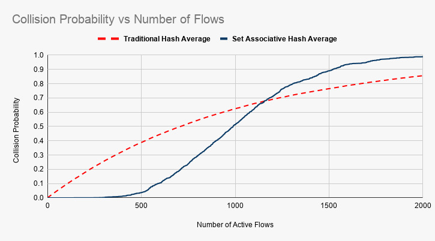

## Validation of Set Associative Hash used in FqCodel in ns-3
The data for the graph is generated through the use of files in this repository. Multiple experiments need to be performed to obtain proper probability average and graph.
### Steps to replicate the graph
* Clone the ns-3-dev repository. Detailed explanation can be found [here](https://gitlab.com/nsnam/ns-3-dev)
* Replace the fq-codel-queue-disc.cc and fq-codel-queue-disc.h file in ns-3-dev/src/traffic-control/model with the given corresponding files in the repository with the same name
* Replace the fq-codel-queue-disc-test-suite.cc files in ns-3-dev/src/test/ns3tc with the given corresponding files in the repository with the same name
* Python code generates the random hash values which will be attributed to each packet
```shell
python hash-generate.py
```
* FqCoDelQueueDiscCollision TestSuite takes as input the file containing the hash values and inputs it into the modified fq-codel-queue-disc. Run the below command in the root directory

```shell
NS_LOG="FqCoDelQueueDisc" ./waf --run "test-runner --suite=fq-codel-queue-disc"

or

NS_LOG="FqCoDelQueueDisc" ./waf --run "test-runner --suite=fq-codel-queue-disc" > generated-file-name
```
* The test will output collision probabilities (sets filled/ total sets or queues filled/total queues) for either the set-associative hash or traditional hash depending on which is enabled in the test suite 
* Input the probabilities into excel sheet and graph probability vs. the number of flows. An example is given [here](https://github.com/AB261/Set-Associative-Hash-fqCodel/blob/master/set_associative_hash.ods) 

### Results:


